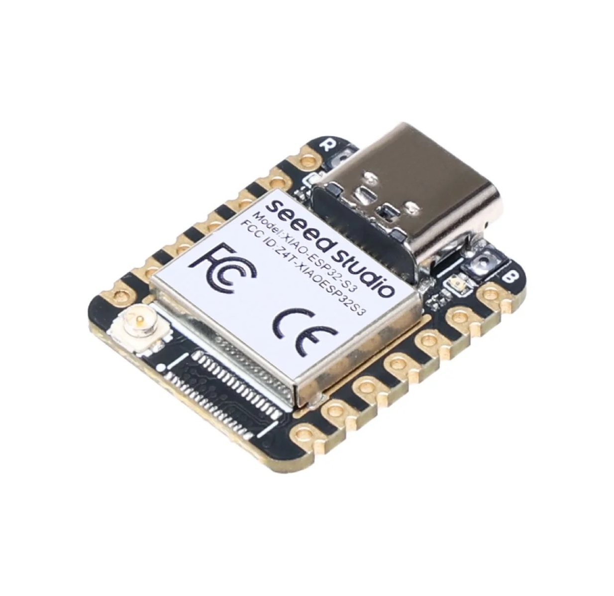
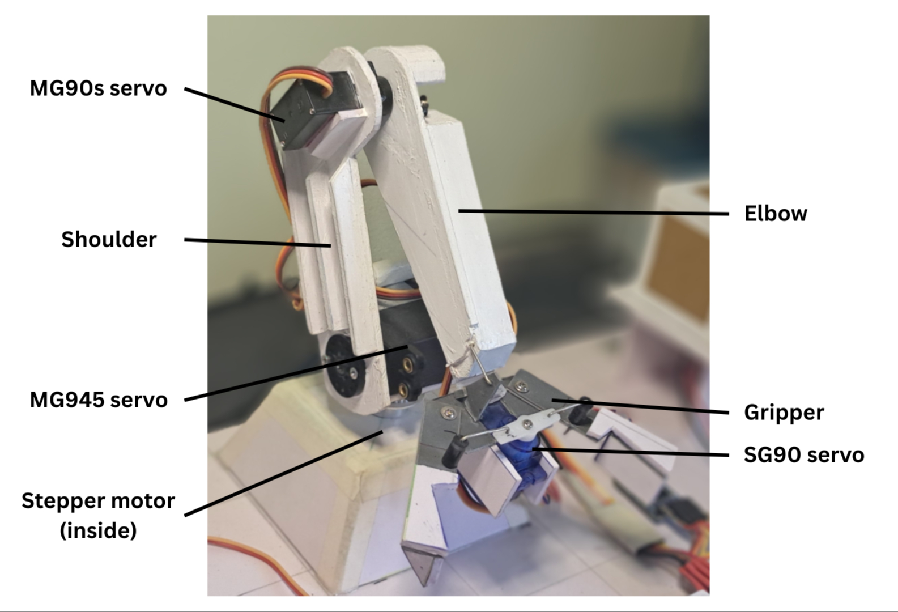

# Autonomous-Robotic-Arm-for-Warehouse-Logistics-Using-TinyML

## Introduction

Modern warehouses require fast, reliable, and intelligent sorting systems to manage increasing demand. Traditional automated solutions are often expensive, power-hungry, and rely heavily on cloud connectivity, making them unsuitable for small-scale industries or secure in-house environments.
This project presents a TinyML-powered autonomous robotic arm capable of detecting, classifying, and sorting boxes using only low-power microcontrollers and edge intelligence.

## Motivation

The primary motivation behind this project is to build a cost-efficient, energy-efficient, and memory-efficient autonomous warehouse solution that operates entirely on edge devices. With an increasing need for secure in-house computation—especially in industries where data privacy is critical—this system eliminates cloud dependency while maintaining smart functionality.
The entire prototype has been developed using minimal resources and low-cost components, proving that advanced warehouse automation is achievable even with limited budgets. This project showcases how TinyML and embedded systems can enable scalable, secure, and sustainable industrial automation.

## Hardware Selection

### 1. ESP32-CAM
Captures images and performs TinyML classification (apple/mango) on-device using MobileNet.

### 2. ESP32 XIAO S3
Central decision-making controller that reads camera triggers, processes LDR inputs, and commands the robotic arm.

### 3. Arduino Nano
Controls the robotic arm by running predefined servo and stepper movement sequences.

### 4. Robotic Arm (4 DOF)
Handmade using 3mm Sunboard sheet; performs autonomous pick-and-place operations.

