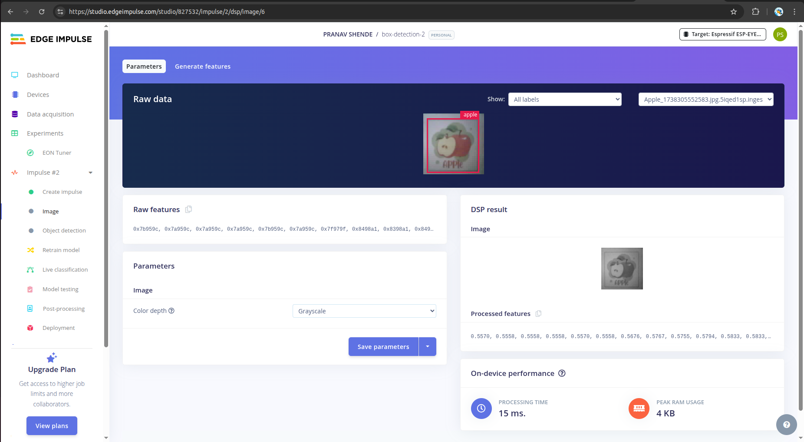
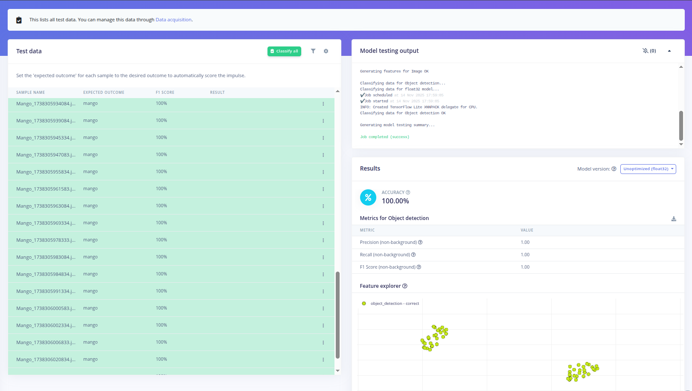
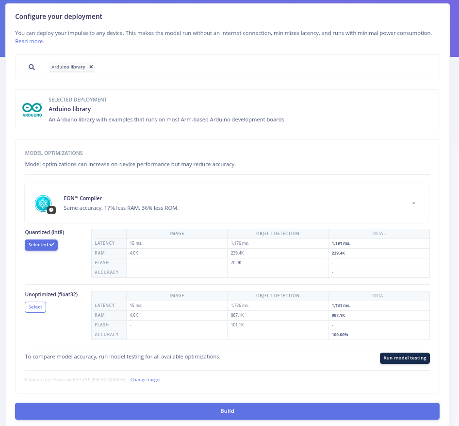
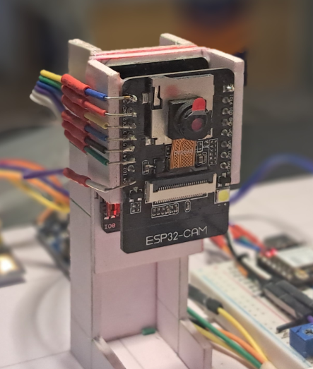
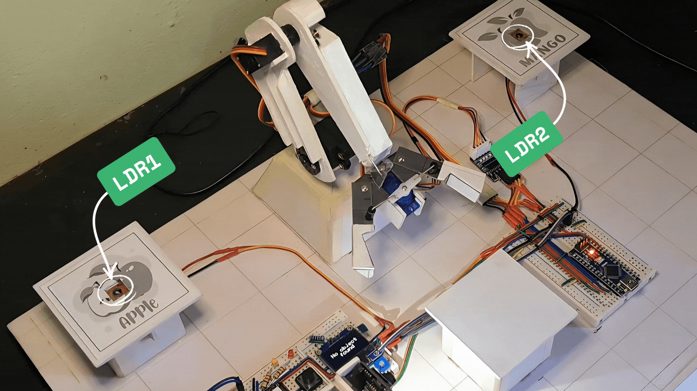
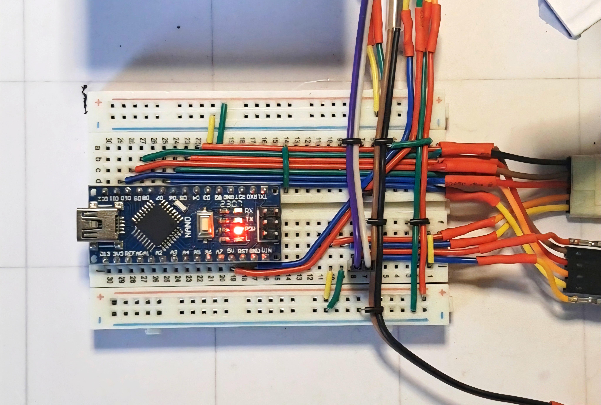
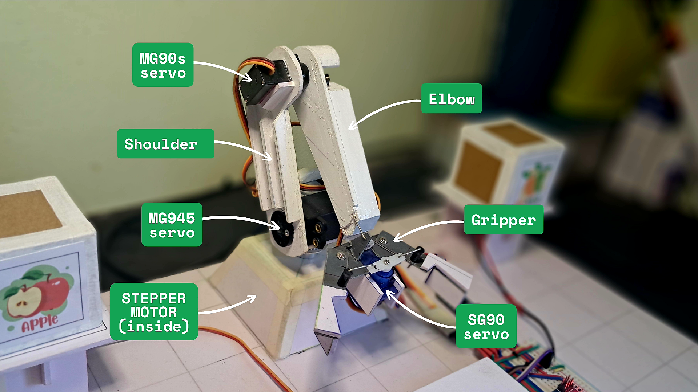

# Autonomous-Robotic-Arm-for-Warehouse-Logistics-Using-TinyML

## Introduction

Modern warehouses require fast, reliable, and intelligent sorting systems to manage increasing demand. Traditional automated solutions are often expensive, power-hungry, and rely heavily on cloud connectivity, making them unsuitable for small-scale industries or secure in-house environments.
This project presents a TinyML-powered autonomous robotic arm capable of detecting, classifying, and sorting boxes using only low-power microcontrollers and edge intelligence.

## Motivation

The primary motivation behind this project is to build a cost-efficient, energy-efficient, and memory-efficient autonomous warehouse solution that operates entirely on edge devices. With an increasing need for secure in-house computation—especially in industries where data privacy is critical—this system eliminates cloud dependency while maintaining smart functionality.
The entire prototype has been developed using minimal resources and low-cost components, proving that advanced warehouse automation is achievable even with limited budgets. This project showcases how TinyML and embedded systems can enable scalable, secure, and sustainable industrial automation.

## Hardware Selection

- ESP32-CAM (AI Thinker)
- ESP32 XIAO S3
- Arduino Nano
- 5V Stepper Motor (Base rotation)
- MG945 Servo (Shoulder)
- MG90S Servo (Elbow)
- SG90 Servo (Gripper)
- LDR Sensors (x2)
- 100kΩ Variable Resistors (x2)
- Red LED (Apple storage indicator)
- Yellow LED (Mango storage indicator)
- 3mm Sunboard Sheet (Robotic arm body)
- Jumper Wires
- Breadboard / PCB
- USB Data Cables
- Power Supply (5V)

## Software & Platforms

- Arduino IDE
- Edge Impulse

#### The project follows a two-phase architecture: 
>In the first phase, development of object detection model in Edge Impulse to classify apple and mango boxes using the ESP32-CAM. 

>In the second phase, object detection model is integrated into a coordinated multi-microcontroller system that handles decision-making and autonomous robotic arm movement.

```bash
Architecture
│
├── Object detection Model Development
│   ├── Data Acquisition
│   ├── Impulse Design
│   └── Model Training & Deployment
│
└── Hardware Integration & Application
    ├── ESP32-CAM (Inference)
    ├── ESP32 XIAO S3 (Decision Control)
    └── Arduino Nano + Robotic Arm (Motion Control)
```


## Object Detection Model Development

### Data Acquisition
I collected my dataset directly using the ESP32-CAM, which I configured as a small web server using the EloquentESP32CAM library. I captured at least 130 images per class (apple and mango boxes) under constant lighting and a clean background. The images were taken at a resolution of 240×240 px, which is suitable for fast training and edge deployment. After capturing, I downloaded the images and uploaded them to Edge Impulse for labeling.

For more details on ESP32-CAM data collection: https://eloquentarduino.com/posts/esp32-cam-object-detection

>  **Note:** while capturing images, I turned on Built-in LED flash for consistent lighting.

In the Labelling queue, all the raw images are shown, and we need to drag and drop the markings and label the boxes accordingly.

You can learn more about the labeling queue here: https://docs.edgeimpulse.com/studio/projects/data-acquisition/labeling-queue.

### Impulse Design

I selected the Image input block with a resolution of 96×96 and chose Fit longest axis. Smaller size makes the model lightweight and faster to run on the ESP32-CAM while still keeping enough detail. for classifying apple and mango boxes.

For the learning block, I selected Object Detection (Images).

<ln/>


Then on the Image section, selected the color depth as “ Grayscale”.<br/>
Grayscale reduces memory usage and speeds up inference while still keeping enough features for classification.

<ln/>

### Model Training

I trained the model for 40 epochs with a learning rate of 0.001, which gave a good balance between speed and stability.<br/>
In the Object detection section, I have selected the FOMO model — FOMO (Faster Objects, More Objects) MobileNetV2 0.35 


 <ln/>

After training, the model achieved an accuracy of around 97.6% on the validation set, which is sufficient for reliable classification in this application.


### Model Testing
After testing model on unseen image data, achieved 100% accuracy.

<ln/>

>  **Note:** I tested multiple models using the same dataset but with different image sizes, dataset sizes and impulse configurations. Some models showed high accuracy inside Edge Impulse, while others showed lower accuracy. However, when deploying them on the ESP32-CAM, the results were different — models with lower reported accuracy sometimes performed better in real conditions, and vice-versa. Hence, the true performance can only be judged after actual deployment on the device. The model I selected above delivered the most reliable results in the real application.

### Model Deployment

In Deployment section, build Arduino library and downloaded using the Quantized (int8) option for efficient on-device execution.

 <ln/>

> **Note:** EON Compiler is selected by default which will reduce the amount of memory required for our model.


## Hardware Integration & Application
```bash
System-Workflow
├── ESP32-CAM
│   ├── Captures image
│   ├── Runs TinyML object detection
│   ├── Checks confidence > 75%
│   └── Sends Apple/Mango GPIO trigger → ESP32-XIAO-S3
│
├── ESP32-XIAO-S3
│   ├── Receives trigger from ESP32-CAM
│   ├── Reads LDR sensors (storage empty/full)
│   ├── Controls Red/Yellow LEDs
│   └── Sends clean Apple/Mango signal → Arduino-Nano
│
└── Arduino-Nano
    ├── Receives trigger signal
    ├── Executes Apple/Mango pick-and-place routine
    └── Controls stepper + servo motors for arm movement

```
### ESP32-CAM (Inference)

Object detection model deployed to the ESP32-CAM board’s flash, so every image it captures is classified on the device itself. 

<ln/>

To avoid wrong detections, I kept a 75% confidence limit, if the confidence is high enough, it activates the corresponding GPIO pin to notify the ESP32 XIAO S3.

```bash
// Apple detection logic with 75% confidence threshold 
if (bb.label=="apple" && bb.value > 0.75) {
        digitalWrite(AppleTrig, HIGH);  
    }
    else {
       digitalWrite(AppleTrig, LOW);
    }
// Mango detection logic with 75% confidence threshold 
if (bb.label== "mango" && bb.value > 0.75) {
        digitalWrite(MangoTrig, HIGH); 
    } 
    else {
        digitalWrite(MangoTrig, LOW);
    }
```
Code Logic Inspiration: https://forum.edgeimpulse.com/t/led-blink-with-esp32-cam-and-object-detection/11919

An OLED display is integrated to show live classification results with confidence values, making it easy to verify predictions without relying on a serial terminal.

<ln/>

To ensure consistent visual conditions, especially in indoor warehouse environments, the ESP32-CAM uses its onboard flash LED, which can be manually enabled through a push button. This eliminates shadows and lighting variations, helping the model maintain stable accuracy in indoor warehouse environments.

<ln/>

#### Code For ESP32-CAM: [View ESP32-CAM Code](code/esp32_cam.ino)


### ESP32 XIAO S3 (Decision Control)

The ESP32 XIAO S3 handles all the decision-level features in the system. It reads the trigger signals coming from the ESP32-CAM. These triggers represent the final classification result apple or mango and are used by the XIAO to decide which pick-and-place action needs to follow. By separating the vision task (handled by ESP32-CAM) from the decision task (handled by XIAO), the system stays modular and avoids any timing conflicts.

<ln/>

LDR sensors placed on the storage units. Each LDR tells whether the apple or mango storage space is empty or already filled with a box. Because LDR readings depend on light intensity, I added a 100kΩ variable resistor to each sensor so I can easily adjust their sensitivity. This ensures that the XIAO always receives accurate information, no matter the ambient lighting conditions.

The use of two indicator LEDs—red(LED2) for the apple unit and yellow(LED1) for the mango unit, these LEDs turn on whenever their corresponding storage unit is full. This helps me quickly understand the status of each unit without checking the serial output, and it also makes the system more user-friendly during testing.

<ln/>

#### Code For ESP32-XIAO: [View ESP32-XIAO Code](code/esp32_xiao.ino)

### Arduino Nano + Robotic Arm (Motion Control)

The Arduino Nano is responsible for controlling the entire motion sequence of the robotic arm. It drives four different actuators: a 5V stepper motor at the base for horizontal rotation, an MG945 servo at the shoulder, an MG90S at the elbow, and an SG90 at the gripper. Each motor has a predefined position and timing that together form the complete pick-and-place movement. By keeping this motion logic inside the Nano, the mechanical control stays smooth and independent of the higher-level decision flow.

<ln/>

<ln/>

Based on which GPIO pin the ESP32 XIAO S3 activates, the Nano decides which predefined path to run. This lets the arm rotate to the correct pickup location, lower itself, grip the box, lift, and place it precisely in the correct storage unit before returning home. Each path is tuned to match the physical layout of the arm and the storage placement.


#### Code For Arduino Nano: [View Arduino Nano Code](code/arduino_nano.ino)